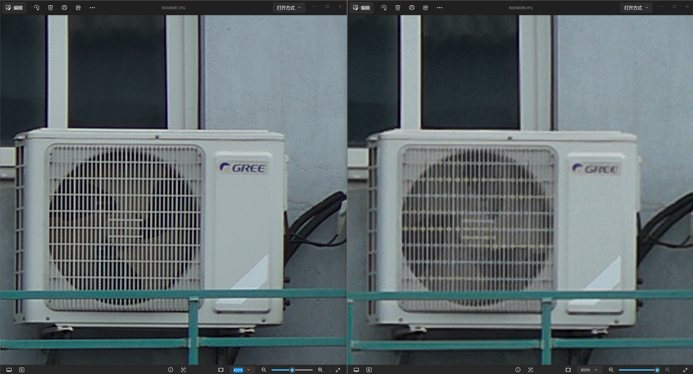

# X2D 四亿像素 JPEG 细节对比

[打开原尺寸截图](assets/x2d-408mp-vs-100mp-detail.png)

## 怎么看这张图

| 位置 | 成片 | 查看器放大倍率 |
| --- | --- | --- |
| 左侧 | 约四亿像素 JPEG | 400% |
| 右侧 | 一亿像素 JPEG | 800% |

两侧采用不同倍率，让同一个主体以相近大小显示。先看空调格栅：左侧细线的分离和交叉处更清楚，右侧可见更明显的模糊与彩色纹样。再看外壳边缘和文字，比较轮廓与局部对比度。保留完整查看器截图，方便核对倍率。

这里的四亿像素指约 408 MP 输出；项目六帧合成的输出尺寸为 23326 × 17498，共 408,158,348 个像素。输出像素数量与真实可分辨细节是不同指标。这张图展示一组实际 JPEG 的视觉差异，不能单凭截图宣称获得四倍光学分辨率。

## 样张边界

这是维护者提供并指定公开的实拍截图，保持原图未裁切、未二次锐化。开发版 JPEG 路径含锐化处理，观感同时受拍摄条件、合成、显影、锐化和查看器缩放影响；本截图未提供完整曝光、对焦和稳定性记录，不作为受控实验测试。

实拍来自开发版流程。公开仓库目前提供研究源码和离线组件，仍没有完整可安装发行包；本展示不改变该交付范围。截图由维护者授权在本项目展示，项目源码的许可证不自动授予该图片的其他再分发权限。

## English

The left image is a roughly 400 MP JPEG displayed at **400%**; the right is a 100 MP JPEG displayed at **800%**. This gives approximately matched subject display size. In this sample, the left grille shows cleaner line separation and intersections, while the right shows more blur and colored patterns.

The original screenshot is preserved without cropping or additional sharpening. Development JPEG processing includes sharpening. Capture conditions, synthesis, rendering and viewer scaling all affect appearance. This is a visual sample comparison, not a controlled measurement of optical resolution gain. The public repository still contains research source and offline components, rather than a complete installable camera release.
